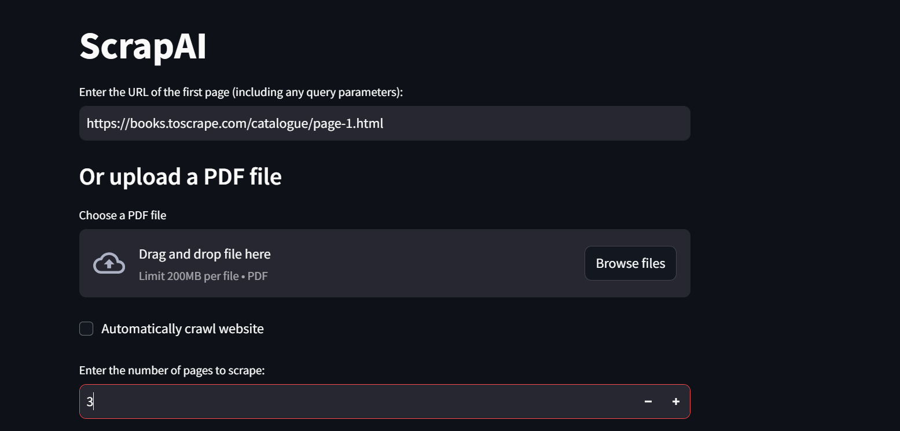
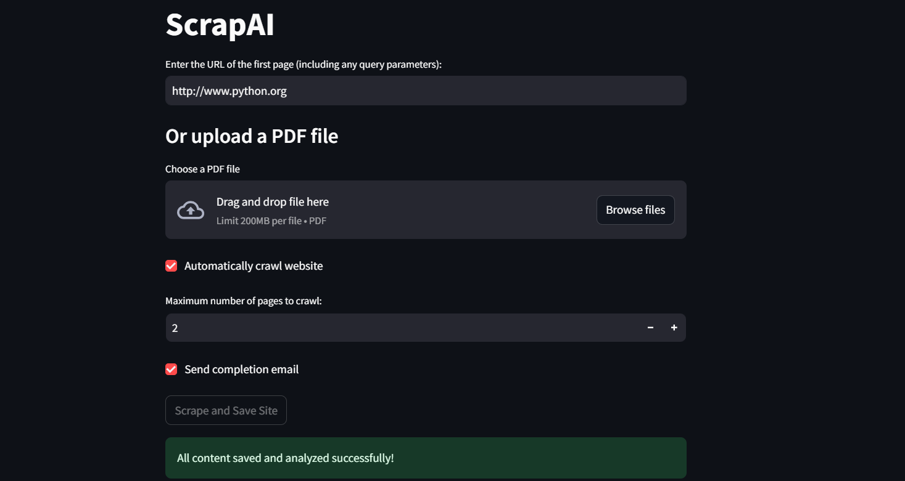
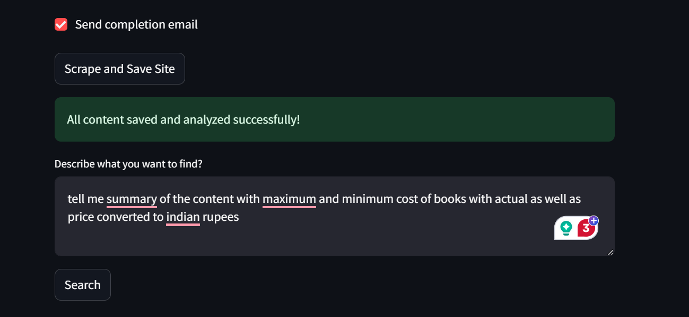
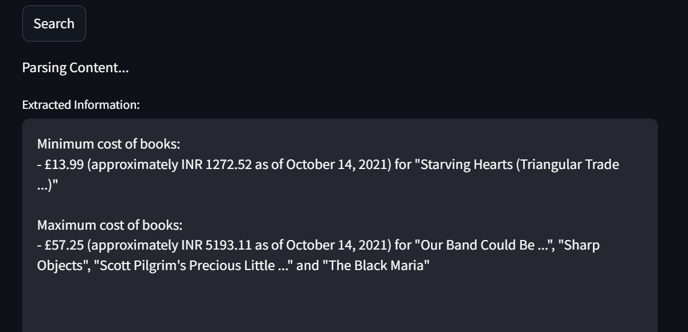
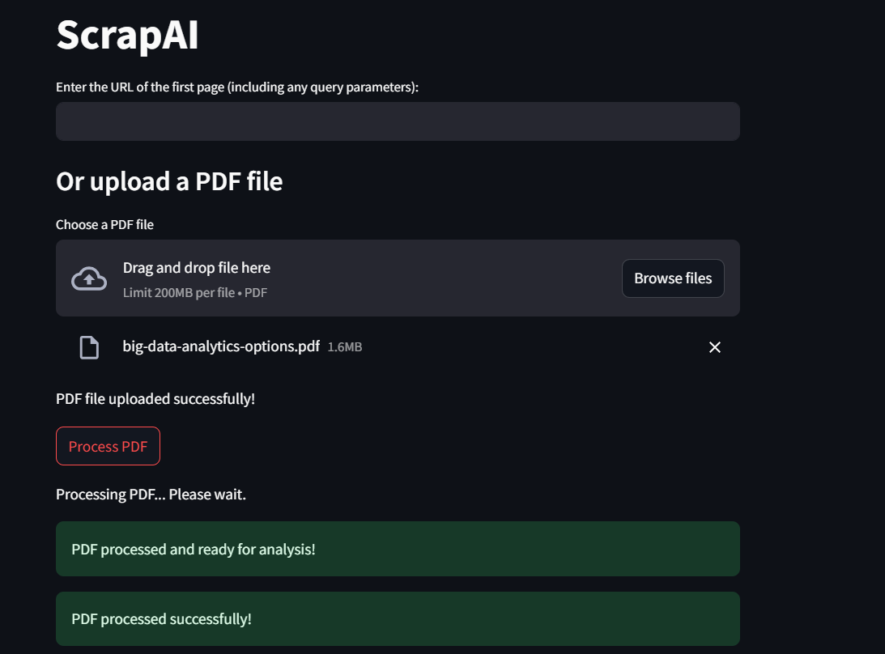
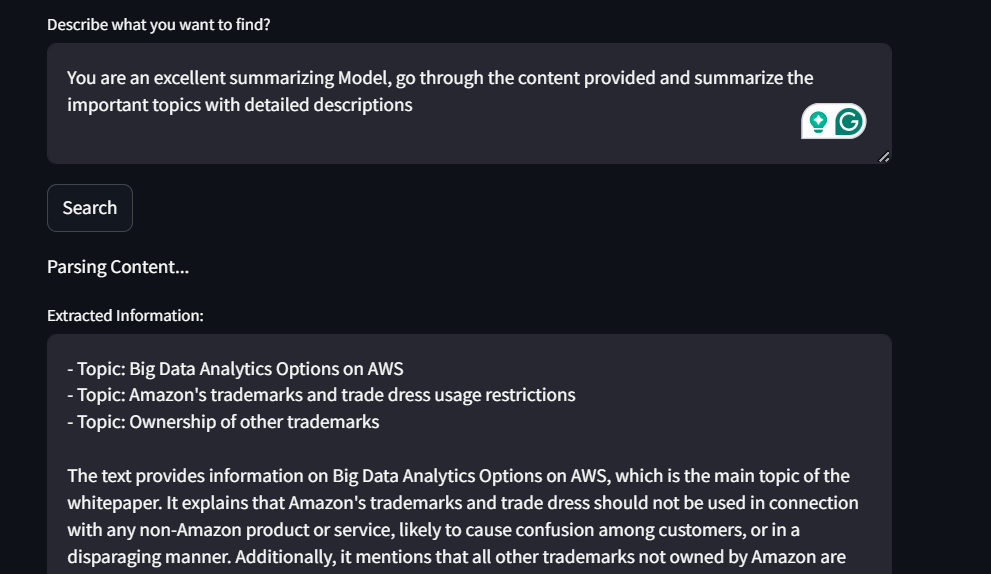
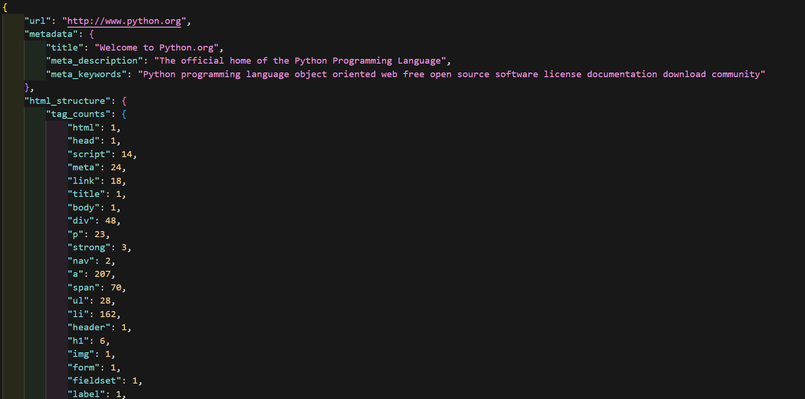
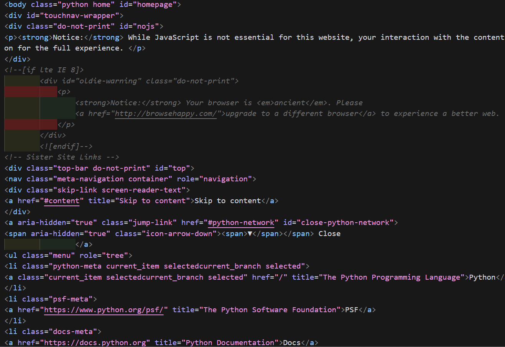

# ScrapAI



ScrapAI is a web scraping and content analysis tool that combines web scraping capabilities with AI-powered content parsing. It can scrape websites, process PDFs, and analyze the content using advanced language models.

## Features

- Web scraping with pagination support
- PDF processing
- Content cleaning and analysis
- AI-powered content parsing using Groq API
- Email notifications for completed scraping tasks

## Screenshots

### ScrapAI Recursive Crawling


### ScrapAI Scraping Feature


### ScrapAI URL ContentParsing


### Pdf Scraping Feature


### ScrapAI LLM Parsing Results


### Analysis Results

#### HTML Analysis JSON Output


#### Original HTML File


## Prerequisites

- Python 3.8+
- Chrome browser (for web scraping)
- ChromeDriver (compatible with your Chrome version)

## Installation

1. Clone the repository:
   ```
   git clone https://github.com/KBhaskarP/ScrapAI.git
   cd ScrapAI
   ```

2. Create and activate a virtual environment:
   ```
   python -m venv venv
   source venv/bin/activate  # On Windows, use `venv\Scripts\Activate.ps1`
   ```

3. Install the required packages:
   ```
   pip install -r requirements.txt
   ```

4. Set up the environment variables:
   Create a `.env` file in the project root and add the following variables:
   ```
   CHROMEDRIVER=/path/to/chromedriver
   SENDER_MAIL=your_email@example.com
   SENDER_PASSKEY=your_email_password
   RECIPIENT_MAIL=recipient@example.com
   GROQ_API_KEY=your_groq_api_key
   GROQ_MODEL=mixtral-8x7b-32768
   Timeout=30
   Max_tokens=1000
   Temperature=0.1
   ```

   Replace the values with your actual configurations.

## Usage

Run the main application:
 ```
 streamlit run main.py
 ```

## Project Structure

- `main.py`: The main Streamlit application
- `utils/`: Directory containing utility functions
  - `scrap.py`: Web scraping functions
  - `cleaner.py`: Content cleaning functions
  - `saveContent.py`: Functions to save scraped content
  - `parseLLM.py`: AI-powered content parsing
  - `body_analyzer.py`: HTML content analysis
  - `pagination.py`: Pagination detection and URL generation
  - `notify.py`: Email notification functions
  - `pdf_processor.py`: PDF processing functions

## Configuration

Before running the project, make sure to:

1. Install ChromeDriver and set its path in the `.env` file.
2. Set up email credentials for notifications.
3. Obtain a Groq API key and set it in the `.env` file.

## Contributing

Contributions are welcome! Please feel free to submit a Pull Request.


